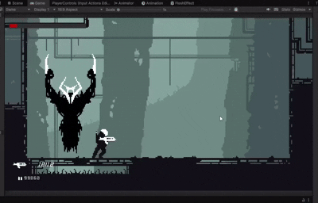
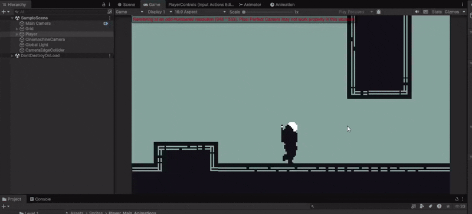
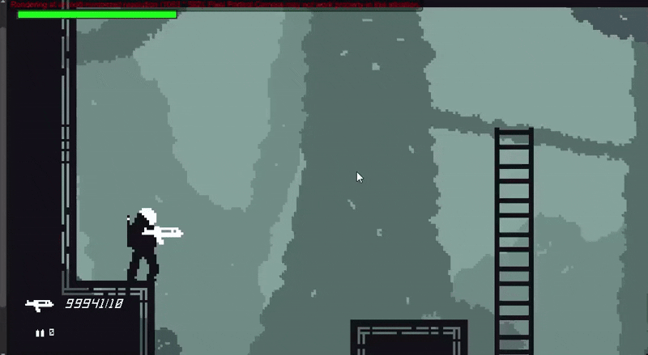
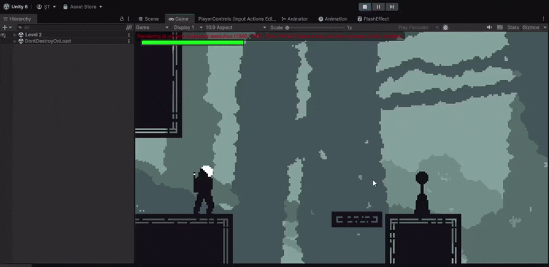
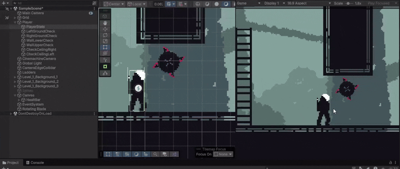

# [2D AKSİYON PLATFORM OYUNUM]

**[2D AKSİYON PLATFORM OYUNUM]**, Unity 6 oyun motoru kullanılarak geliştirilmiş, hızlı tempolu bir 2D Aksiyon Platform oyunudur. Proje, akıcı karakter hareketleri, modüler yetenek sistemi ve state machine tabanlı yapay zeka mekanikleri üzerine odaklanmaktadır.

### Meydan Okuyan Boss Savaşı
Oyunun mevcut bölümlerinin sonunda, oyuncunun o ana kadar öğrendiği tüm yetenekleri test eden, kendine özgü saldırı desenlerine ve aşamalara sahip bir boss savaşı bulunmaktadır.

Boss'un yapay zekası da, tıpkı diğer düşmanlar gibi, modüler bir **State Machine** yapısı üzerine kurulmuştur. Bu mimari, boss'un 'Saldırı Modu', 'Savunma Pozisyonu' ve 'Özel Yetenek Kullanımı' gibi farklı durumlar arasında dinamik olarak geçiş yapmasını sağlayarak karmaşık ve öngörülemez bir dövüş sunar.

## Oyun Mekanikleri ve Özellikler

Bu bölümde, projenin temel mekanikleri ve özellikleri GIF'ler aracılığıyla sergilenmektedir.

### Akıcı Platform Hareketleri
Karakter, `State Machine` mimarisi sayesinde akıcı ve tepkisel bir kontrol şemasına sahiptir. Bu yapı, duvarda kayma, çift zıplama ve dash gibi yetenekler arasında anlık geçişler yapılmasına olanak tanır.

---

### Taktiksel Silah Kullanımı
Oyuncunun, mermi sayısını ve şarjör durumunu anlık olarak takip etmesi gerekir. Mermiler, haritadaki belirli noktalardan toplanabilir ve bu da oyuncuyu keşfe teşvik eder.

---

### Dinamik Harita ve Keşif
Oyuncunun ilerlemesini ve dünyadaki konumunu görebileceği bir harita sistemi mevcuttur. Bu, özellikle çok sayıda bölümü olan bir oyunda oyuncunun kaybolmasını engeller ve keşif hissini güçlendirir.

---

### Çevresel Tehlikeler ve Tuzaklar
Bölümler, oyuncunun dikkatli ve zamanlamalı hareket etmesini gerektiren çeşitli tuzaklarla donatılmıştır. Bu tuzaklar, platform deneyimine ekstra bir zorluk katmanı ekler.

## Ana Özellikler

- **Akıcı ve Yetenek Odaklı Karakter Kontrolü:**
  - State Machine mimarisi sayesinde anında geçiş yapılabilen yetenekler.
  - **Dash:** İleriye doğru hızlı atılma.
  - **Wall Slide:** Duvarlarda kayarak inme.
  - **Double Jump:** Havada ekstra zıplama hakkı.
  - **Çok Yönlü Ateş Etme:** Hem ileriye hem de yukarıya ateş edebilme.
  - **Taktiksel Oynanış:** Şarjör değiştirme ve yerden mermi toplama mekanikleri.

- **Çeşitli Düşmanlar ve Zorlu Boss:**
  - **3 Farklı Düşman Tipi:** Projede yakın dövüş (Demon), menzilli (Ranger) ve yerde gezinen (Örümcek) olmak üzere 3 farklı düşman bulunmaktadır.
  - **Gelişmiş Düşman Yapay Zekası:** Her düşman tipi, `switch-case` yapısıyla oluşturulmuş kendi State Machine'ine sahiptir (Takip Etme, Saldırı, Bekleme durumları vb.).
  - **Epik Boss Savaşı:** Oyunun sonunda, kendine özgü saldırı desenlerine ve yapay zekaya sahip bir Boss bölümü yer almaktadır.

- **Dinamik Oyun Dünyası:**
  - **3 Ana Bölüm + 1 Boss Bölümü:** Farklı tasarımlara sahip keşfedilebilir seviyeler.
  - **Parallax Efekti:** Arka plan katmanlarına uygulanan parallax efekti ile oyuna derinlik hissi ve hareket illüzyonu kazandırılmıştır.
  - **Harita Sistemi:** Oyuncunun ilerlemesini takip edebileceği bir harita mevcuttur.

- **Görsel ve İşitsel Cila:**
  - **Akıcı Animasyonlar:** Ana karakter, düşmanlar ve Boss için tüm durumlara (koşma, zıplama, saldırma, hasar alma vb.) özel animasyonlar ve geçişler.
  - **Partikül Efektleri:** Ateş etme, mermi çarpması, zıplama gibi aksiyonları güçlendiren görsel efektler.

## Teknik Detaylar

Bu projenin temelini, kodun modülerliğini ve genişletilebilirliğini sağlayan **State Machine Mimarisi** oluşturmaktadır.

- **Oyuncu Karakteri:** Karakterin tüm yetenekleri (Dash, Wall Slide vb.) birer "state" olarak tasarlanmıştır. Bu sayede yeni yetenekler eklemek veya mevcut yetenekleri değiştirmek oldukça kolaydır.
- **Düşman Yapay Zekası:** Düşman ve Boss yapay zekaları, yine State Machine deseni kullanılarak tasarlanmıştır. Bu yapı, düşmanların farklı durumlara (idle, chase, attack) göre dinamik kararlar almasını sağlar ve karmaşık davranışların yönetilmesini basitleştirir.
- **Motor:** Proje, Unity'nin en güncel versiyonlarından biri olan **Unity 6** üzerinde geliştirilmiştir.

## Kullanılan Teknolojiler

- **Oyun Motoru:** `Unity 6`
- **Programlama Dili:** `C#`
- **Versiyon Kontrol:** `Git & GitHub`
